All known figures of the Eldoria Expanse, grouped by faction. Characters may appear under every faction they belong to.

## Player Characters

Campaign 1

<a class="char-card" href="player-characters/aella-galefri">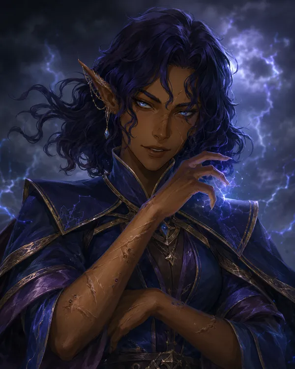

Aella Galefri

Played by Jeff

</a>
<a class="char-card" href="player-characters/aeron-velmont">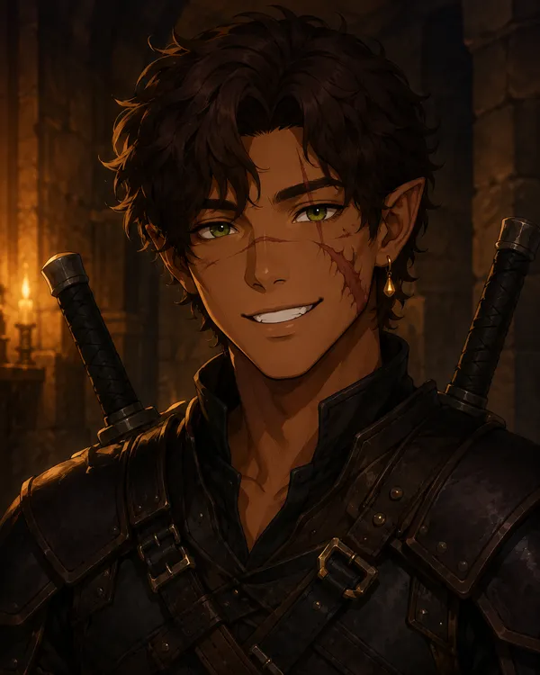

Aeron Velmont

Played by Marco

</a>
<a class="char-card" href="player-characters/cyris-voss">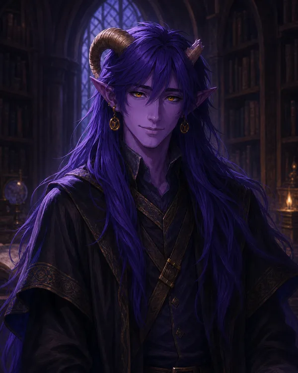

Cyris Voss

Played by Trace

</a>
<a class="char-card" href="player-characters/kieran-arden">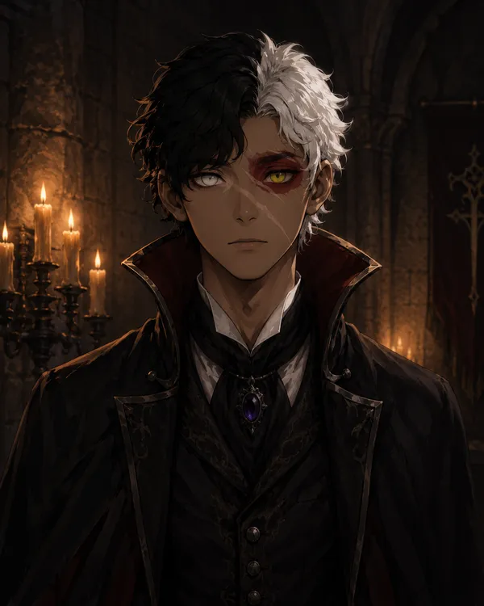

Kieran Arden

Played by Marco

</a>
<a class="char-card" href="player-characters/kip">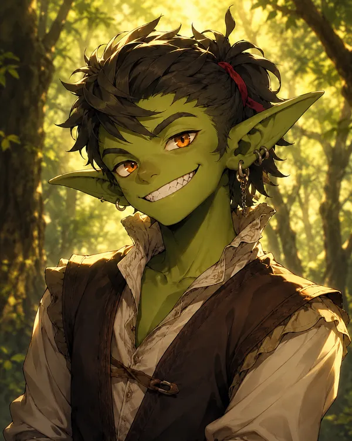

Kip

Played by Matthew

</a>
<a class="char-card" href="player-characters/seros-ashwalker">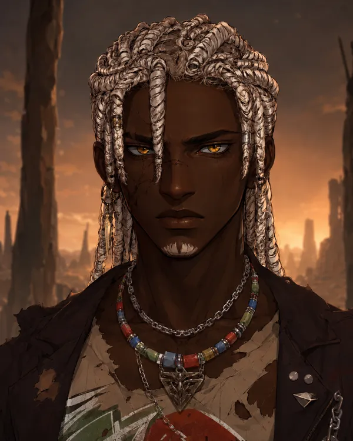

Seros Ashwalker

</a>
<a class="char-card" href="player-characters/solstice-shuriv">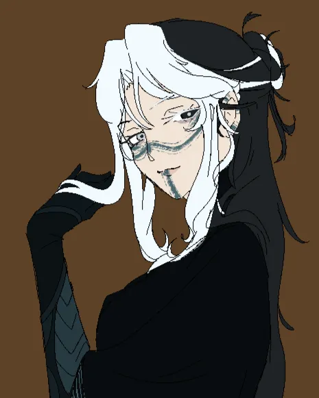

Solstice Shuriv

Played by Sunn

</a>

Campaign 2

<a class="char-card" href="player-characters/aevos">

Aevos

Played by Jeff

</a>
<a class="char-card" href="player-characters/callum">

Callum

Played by Bonner

</a>
<a class="char-card" href="player-characters/garrick">

Garrick

Played by Gio

</a>
<a class="char-card" href="player-characters/kaisel-irvenest">

Kaisel Irvenest

Played by Tre

</a>
<a class="char-card" href="player-characters/tirian-dawnmere">

Tirian Dawnmere

Played by Trace

</a>

## The Crown

<a href="organizations/the-kingsguard">The Kingsguard</a>

<a class="char-card" href="characters/kingsguard/manuel">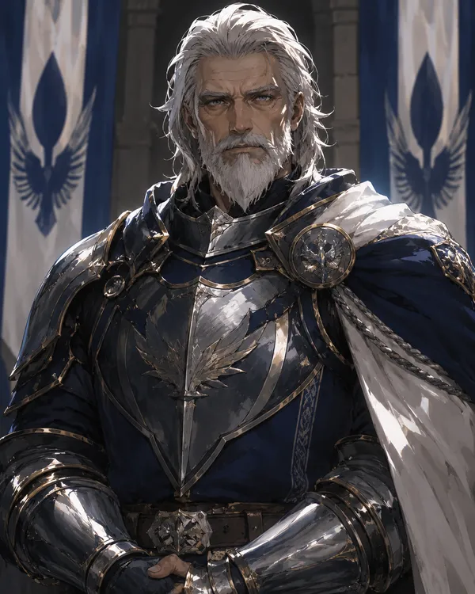

Manuel

Lord Protector of the King's Guard

</a>
<a class="char-card" href="characters/kingsguard/damian-grimm">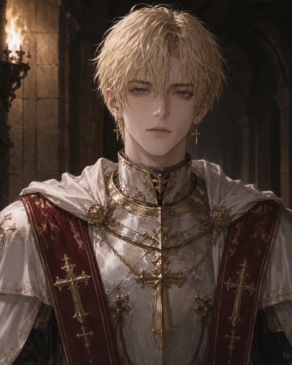

Damian Grimm

Blade of the King

</a>
<a class="char-card" href="characters/kingsguard/kylo-wisemoon">

Kylo Wisemoon

Royal Protector of the Royal Family

</a>
<a class="char-card" href="characters/kingsguard/jeane-howelle">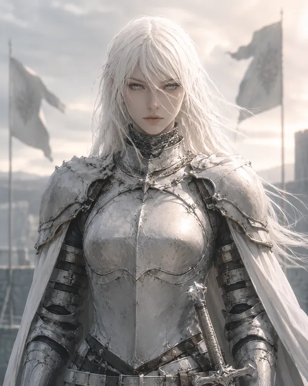

Jeane Howelle

Queen's Guard

</a>
<a class="char-card" href="characters/kingsguard/lucius-raymor">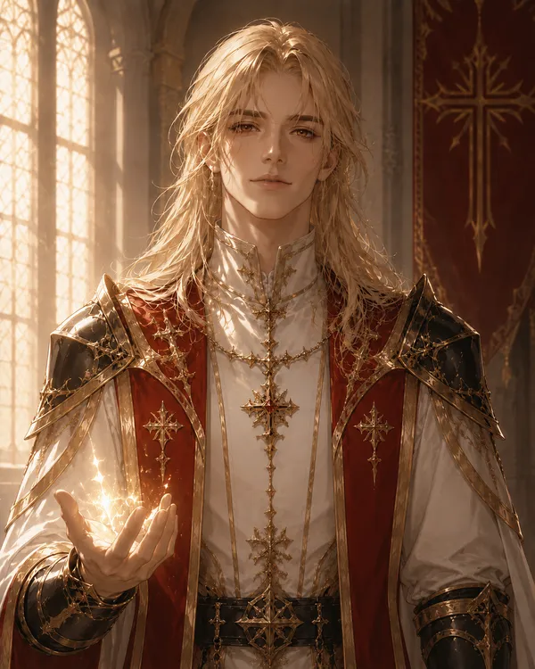

Lucius Raymor

Chosen of Aria

</a>

<a href="organizations/king's-crown">King's Crown</a>

<a class="char-card" href="characters/archibald-howell">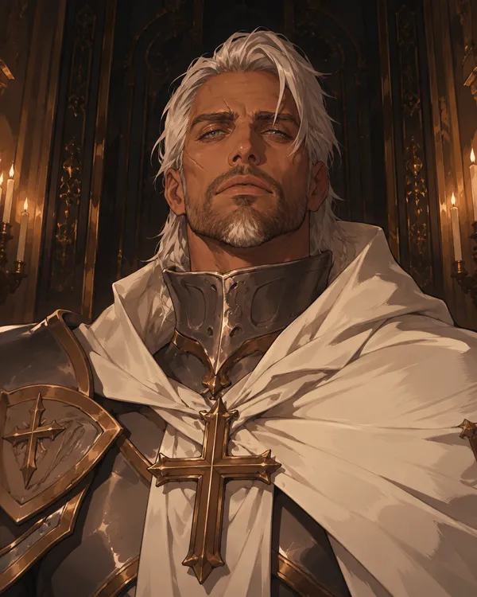

Archibald Howell

The High Septon

</a>
<a class="char-card" href="characters/veritas-aletheia">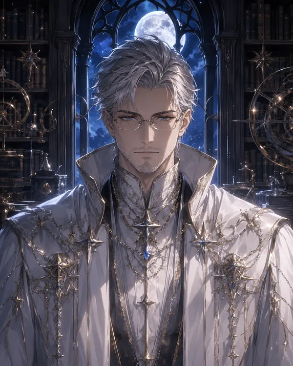

Veritas Aletheia

The Grand Arbiter

</a>
<a class="char-card" href="characters/oldric-ameris">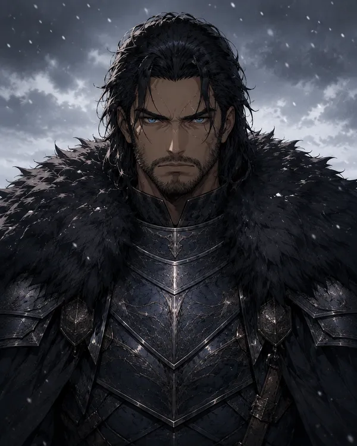

Oldric Ameris

The Warmaster

</a>
<a class="char-card" href="characters/elric-fletcher">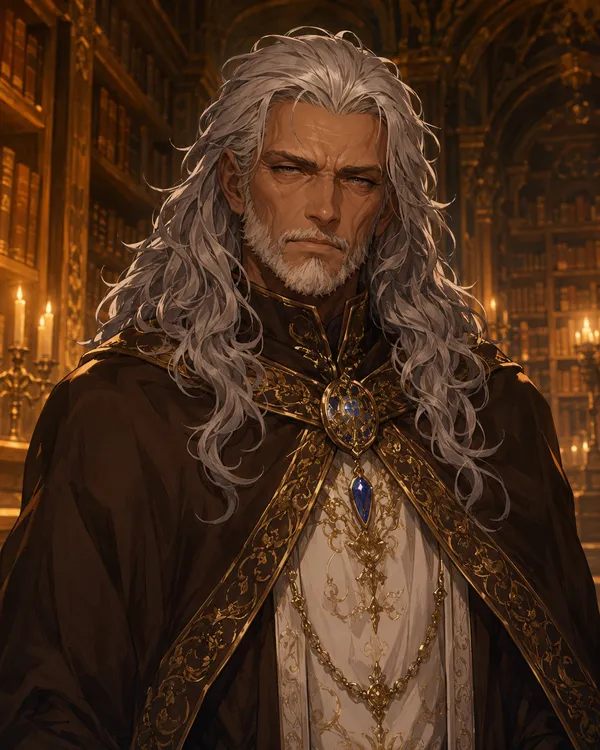

Elric Fletcher

The Archmaester

</a>
<a class="char-card" href="characters/lucerin-atreides">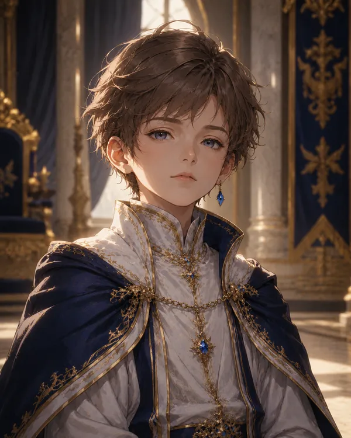

Lucerin Atreides

</a>

## Noble Houses

<a href="organizations/noble-houses/house-aberra">House Aberra</a>

<a class="char-card" href="characters/kingsguard/lucius-raymor">

Lucius Raymor

through his mother Elara Aberra

</a>

<a href="organizations/noble-houses/house-ameris">House Ameris</a>

<a class="char-card" href="characters/oldric-ameris">

Oldric Ameris

War Master of King's Crown

</a>
<a class="char-card" href="characters/lumiere-ameris">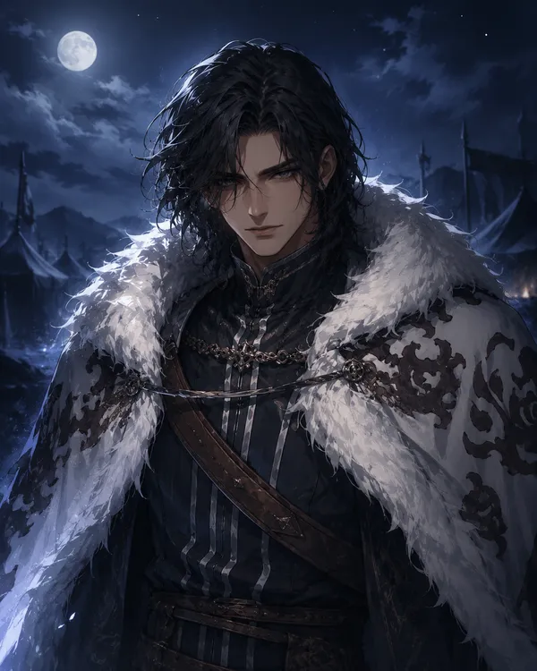

Lumiere Ameris

most notable current member among the younger generation

</a>

<a href="organizations/noble-houses/house-atreides">House Atreides</a>

<a class="char-card" href="characters/lucerin-atreides">

Lucerin Atreides

current King of Brittania

</a>
<a class="char-card" href="characters/backstory-npcs/leo-atreides">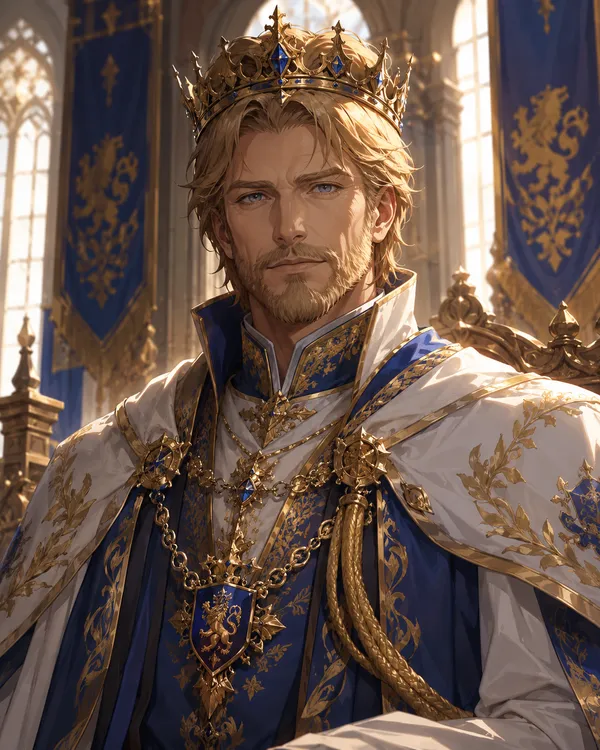

Leo Atreides

former King

</a>
<a class="char-card" href="characters/backstory-npcs/myrcella-atreides">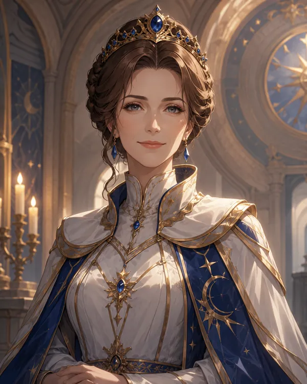

Myrcella Atreides

former Queen

</a>
<a class="char-card" href="characters/backstory-npcs/godwyn-atreides">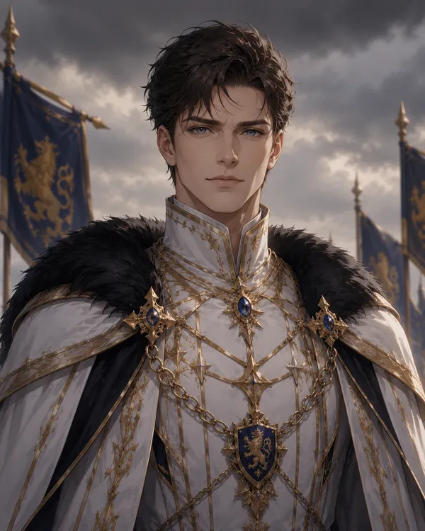

Godwyn Atreides

First Prince, age 25

</a>
<a class="char-card" href="characters/backstory-npcs/gideon-atreides">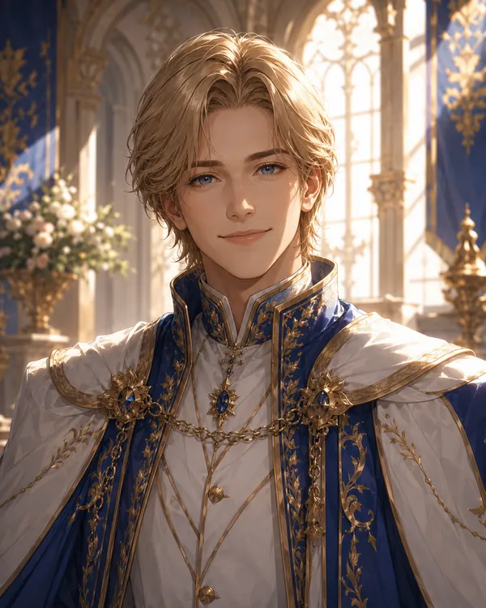

Gideon Atreides

Second Prince, age 23

</a>
<a class="char-card" href="characters/backstory-npcs/catherine-atreides">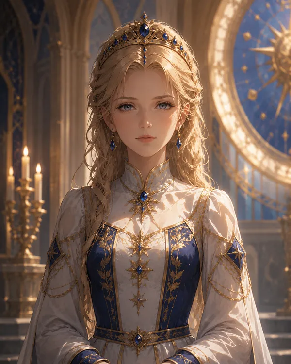

Catherine Atreides

First Princess, age ~16

</a>
<a class="char-card" href="characters/backstory-npcs/violet-atreides">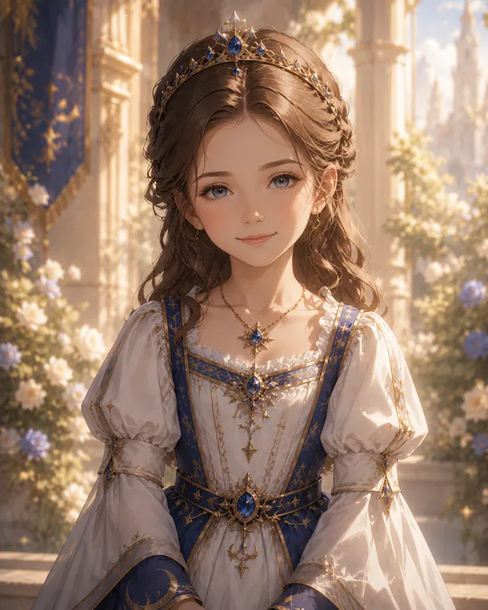

Violet Atreides

Second Princess, age ~8

</a>
<a class="char-card" href="characters/backstory-npcs/elio-atreides">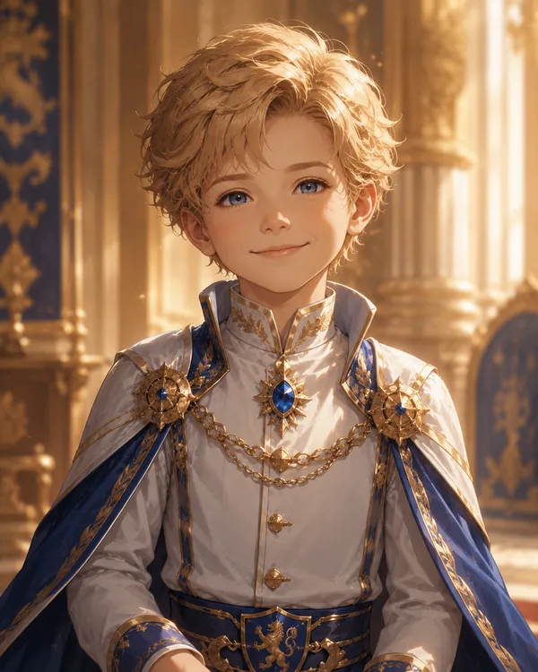

Elio Atreides

Fourth Prince, age 5

</a>
<a class="char-card" href="characters/backstory-npcs/iris-atreides">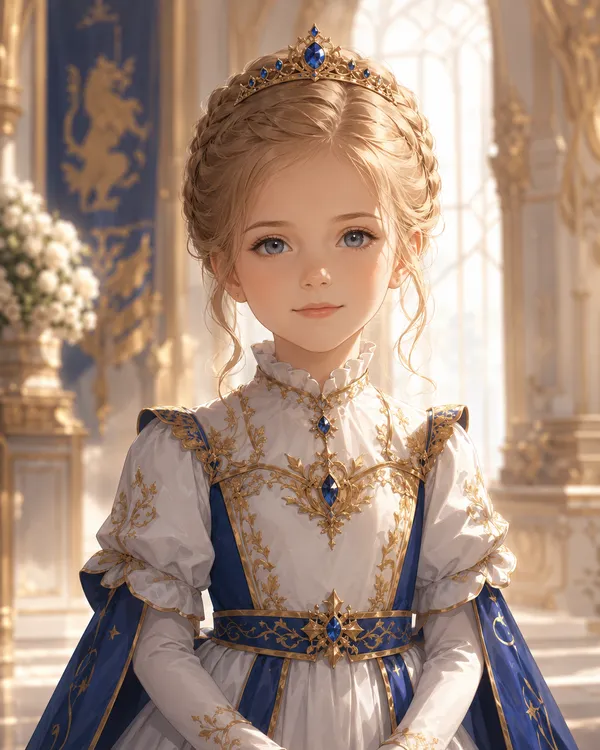

Iris Atreides

Third Princess, age 5

</a>
<a class="char-card" href="characters/oldric-ameris">

Oldric Ameris

Leo's younger brother, born Oldric Atreides

</a>
<a class="char-card" href="characters/backstory-npcs/arthur-atreides">

Arthur Atreides

</a>

<a href="organizations/noble-houses/house-dawnmere">House Dawnmere</a>

<a class="char-card" href="player-characters/tirian-dawnmere">

Tirian Dawnmere

sole surviving heir

</a>
<a class="char-card" href="characters/backstory-npcs/sorin-dawnmere">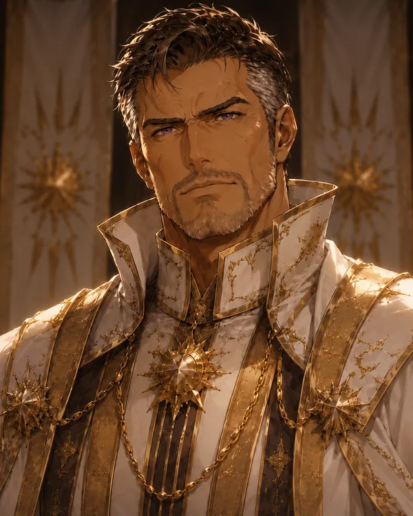

Sorin Dawnmere

former head of house

</a>
<a class="char-card" href="characters/backstory-npcs/lirien-dawnmere">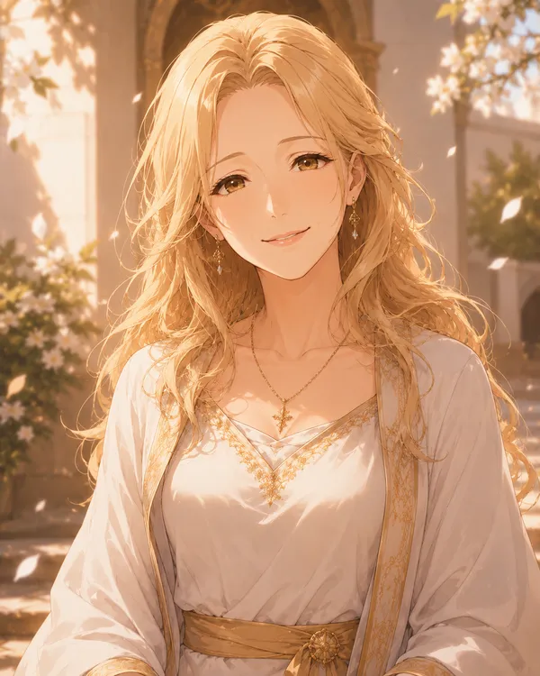

Lirien Dawnmere

Sorin's wife, former commoner

</a>
<a class="char-card" href="characters/backstory-npcs/auris-dawnmere">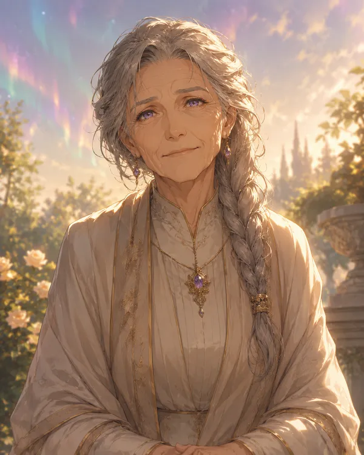

Auris Dawnmere

Sorin's mother, the grandmother

</a>
<a class="char-card" href="characters/backstory-npcs/finn-dawnmere">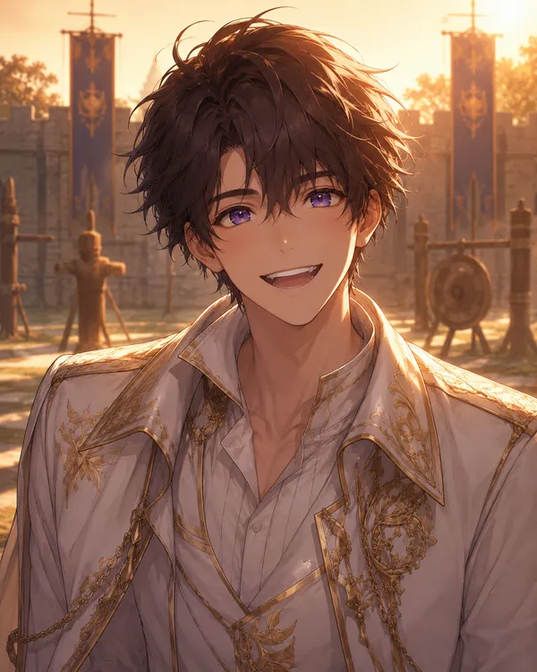

Finn Dawnmere

Tirian's younger brother (16 at death)

</a>
<a class="char-card" href="characters/backstory-npcs/lyra-dawnmere">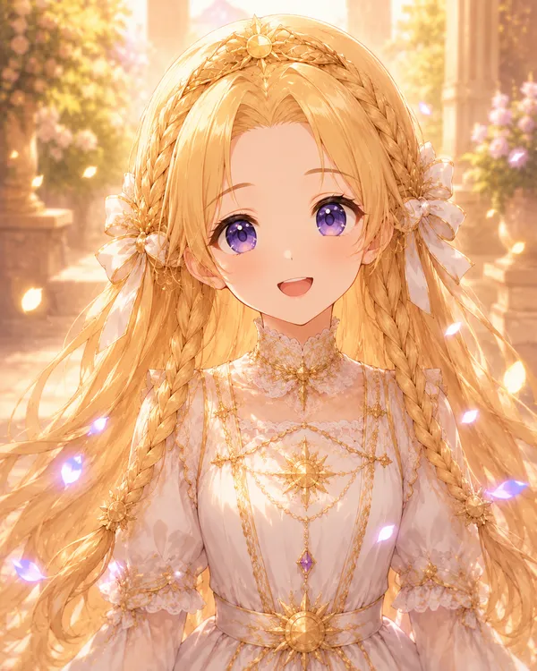

Lyra Dawnmere

Tirian's younger sister (12 at death)

</a>
<a class="char-card" href="characters/osric-hollowell">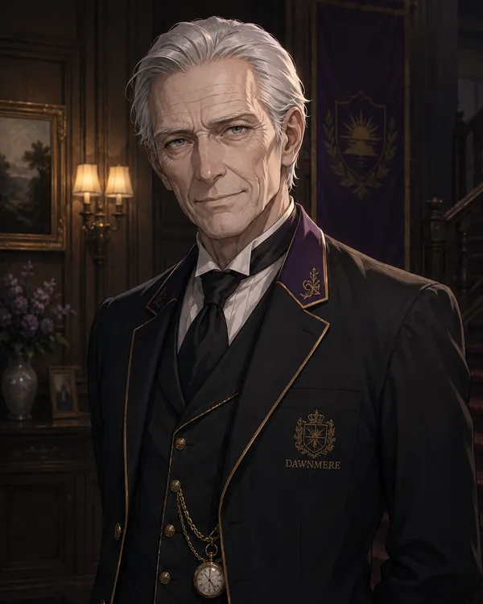

Osric Hollowell

steward

</a>
<a class="char-card" href="characters/margit-thorne">

Margit Thorne

head maid

</a>
<a class="char-card" href="characters/marielle-penn">

Marielle Penn

junior maid

</a>
<a class="char-card" href="characters/corvin-ashe">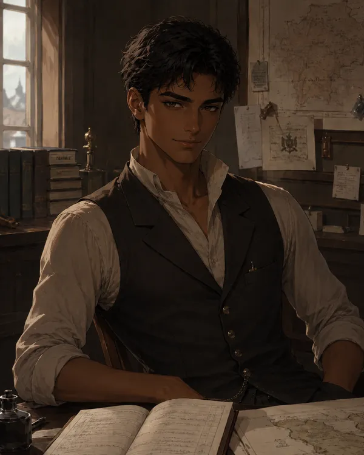

Corvin Ashe

political and financial advisor

</a>

<a href="organizations/noble-houses/house-galefri">House Galefri</a>

<a class="char-card" href="characters/backstory-npcs/torr-galefri">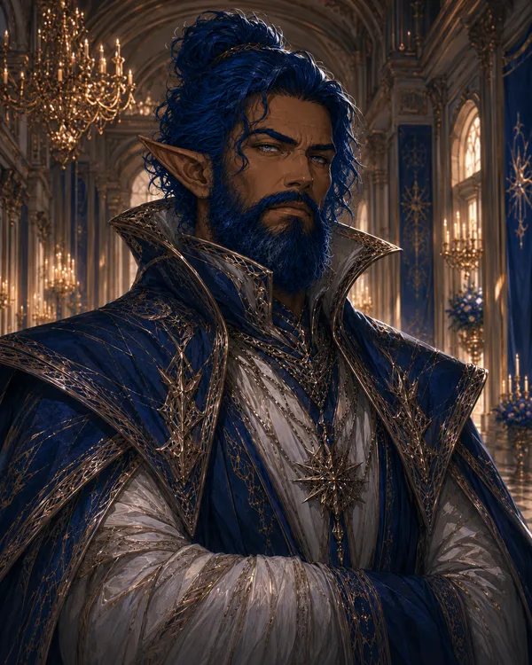

Torr Galefri

head of the house and head of Church of the Storm

</a>
<a class="char-card" href="characters/backstory-npcs/arashi-galefri">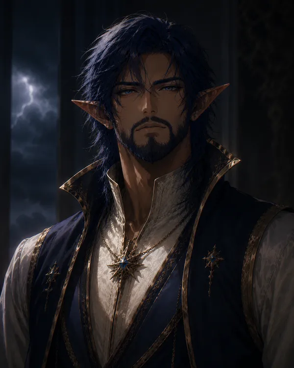

Arashi Galefri

eldest son

</a>
<a class="char-card" href="characters/backstory-npcs/whiro-galefri">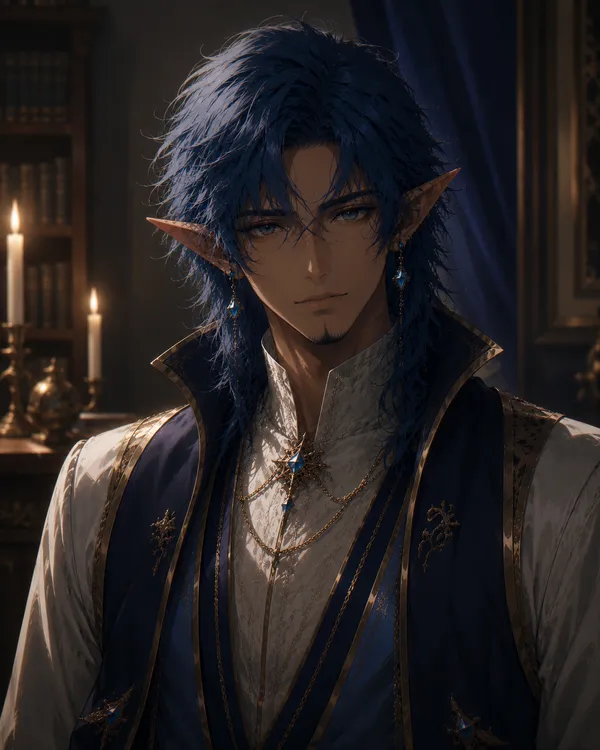

Whiro Galefri

second son

</a>
<a class="char-card" href="player-characters/aella-galefri">

Aella Galefri

daughter (banished)

</a>
<a class="char-card" href="characters/backstory-npcs/urami-galefri">

Urami Galefri

wife of Torr

</a>

<a href="organizations/noble-houses/house-greenleaf">House Greenleaf</a>

<a class="char-card" href="characters/orelia-greenleaf">

Orelia Greenleaf

the Elven Princess

</a>

<a href="organizations/noble-houses/house-howelle">House Howelle</a>

<a class="char-card" href="characters/olenna-howelle">

Olenna Howelle

grandmother of Jeane

</a>
<a class="char-card" href="characters/kingsguard/jeane-howelle">

Jeane Howelle

Queen's Guard of The Kingsguard

</a>
<a class="char-card" href="characters/archibald-howell">

Archibald Howell

</a>

<a href="organizations/noble-houses/house-irvenest">House Irvenest</a>

<a class="char-card" href="characters/backstory-npcs/roland-irvenest">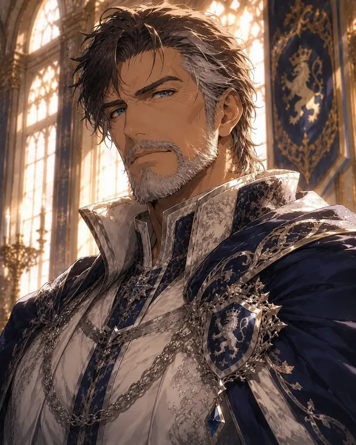

Roland Irvenest

Patriarch

</a>
<a class="char-card" href="characters/backstory-npcs/catherine-irvenest">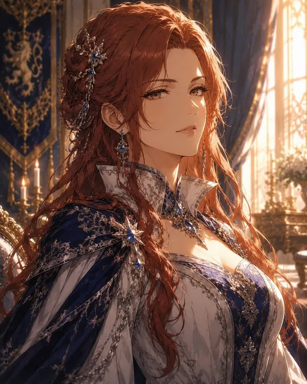

Catherine Irvenest

Matriarch

</a>
<a class="char-card" href="characters/backstory-npcs/cedric-irvenest">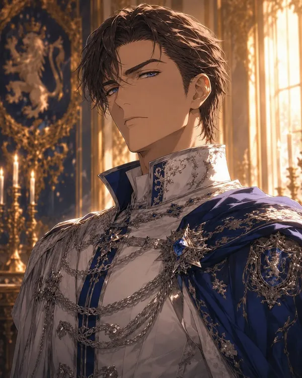

Cedric Irvenest

eldest child (age 28)

</a>
<a class="char-card" href="characters/backstory-npcs/amelia-irvenest">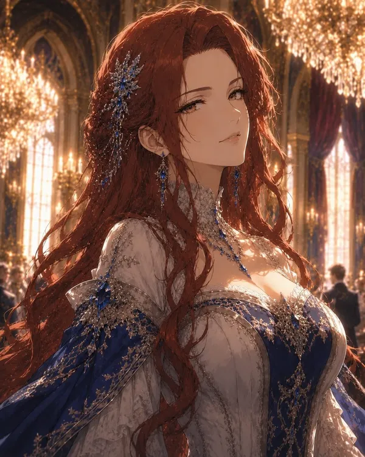

Amelia Irvenest

(age 27)

</a>
<a class="char-card" href="characters/backstory-npcs/elliot-irvenest">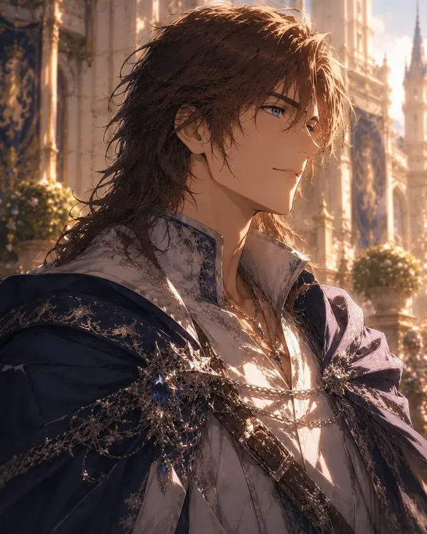

Elliot Irvenest

(age 25)

</a>
<a class="char-card" href="characters/backstory-npcs/eleanor-irvenest">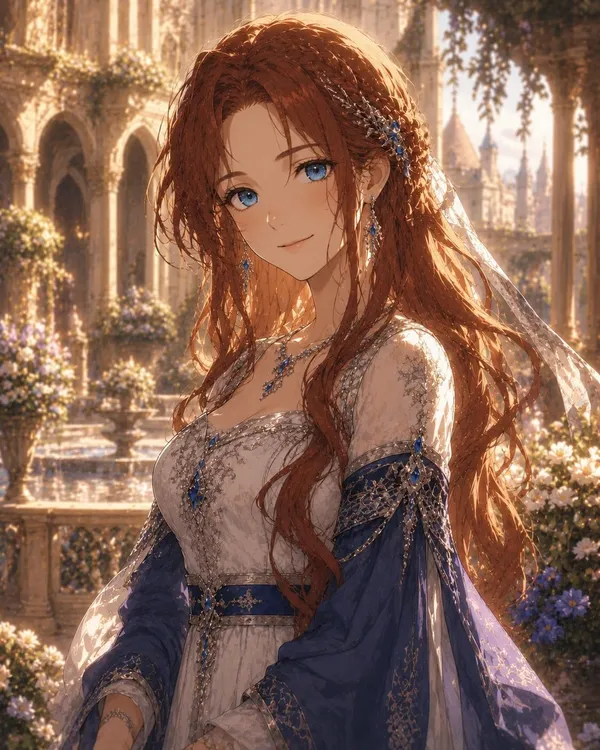

Eleanor Irvenest

(age 24)

</a>
<a class="char-card" href="characters/backstory-npcs/elizabeth-irvenest">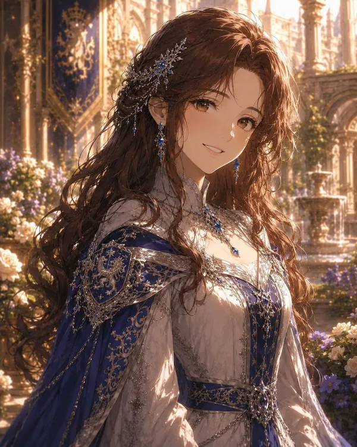

Elizabeth Irvenest

adopted daughter (age 22)

</a>
<a class="char-card" href="player-characters/kaisel-irvenest">

Kaisel Irvenest

adopted son (age 20)

</a>

<a href="organizations/noble-houses/house-justicar">House Justicar</a>

<a class="char-card" href="characters/vera-justicar">

Vera Justicar

High Priestess

</a>
<a class="char-card" href="characters/vero-justicar">

Vero Justicar

Vera's son

</a>

<a href="organizations/noble-houses/house-lyons">House Lyons</a>

<a class="char-card" href="characters/lucas-lyons">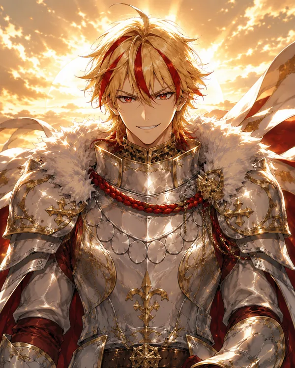

Lucas Lyons

the Lionheart

</a>

<a href="organizations/noble-houses/house-morningstar">House Morningstar</a>

<a class="char-card" href="characters/karsus-morningstar">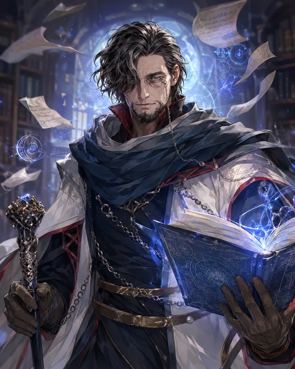

Karsus Morningstar

Headmaster of Strixhaven and Grand Mage of Brittania

</a>
<a class="char-card" href="characters/merlin-morningstar">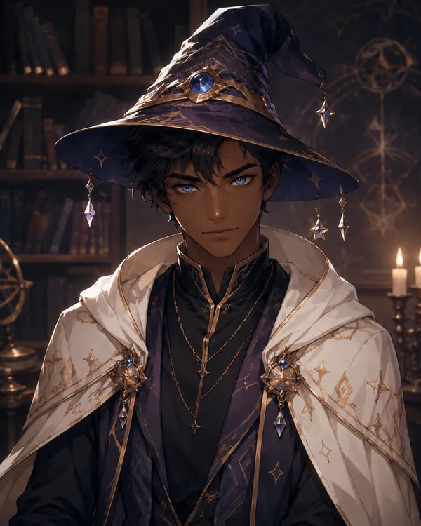

Merlin Morningstar

"The Prodigy of Potential"

</a>

<a href="organizations/noble-houses/house-raymor">House Raymor</a>

<a class="char-card" href="characters/silas-raymor">

Silas Raymor

Duke

</a>
<a class="char-card" href="characters/kingsguard/lucius-raymor">

Lucius Raymor

Chosen of Aria

</a>
<a class="char-card" href="characters/asterin-raymor">

Asterin Raymor

High Priest of the Church of Light

</a>
<a class="char-card" href="player-characters/aevos">

Aevos

member of House Raymor but does not carry the name

</a>

<a href="organizations/noble-houses/house-st.-james">House St. James</a>

<a class="char-card" href="characters/ludwig-st.-james">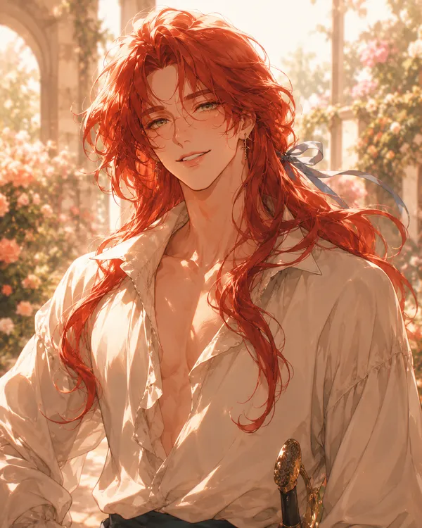

Ludwig St. James

heir to the house

</a>

<a href="organizations/noble-houses/house-velmont">House Velmont</a>

<a class="char-card" href="player-characters/aeron-velmont">

Aeron Velmont

assigned to the party (Session 9)

</a>

<a href="organizations/noble-houses/house-whitlocke">House Whitlocke</a>

<a class="char-card" href="characters/kingsguard/raevyn-whitlocke">

Raevyn Whitlocke

the original founder of the Kingsguard

</a>

## Churches

<a href="organizations/churches/church-of-light">Church of Light</a>

<a class="char-card" href="characters/asterin-raymor">

Asterin Raymor

High Priest

</a>
<a class="char-card" href="characters/kingsguard/lucius-raymor">

Lucius Raymor

Chosen of Aria

</a>
<a class="char-card" href="player-characters/tirian-dawnmere">

Tirian Dawnmere

public affiliate (Campaign 2)

</a>
<a class="char-card" href="player-characters/aevos">

Aevos

Chosen of Aria

</a>
<a class="char-card" href="characters/backstory-npcs/seyrell">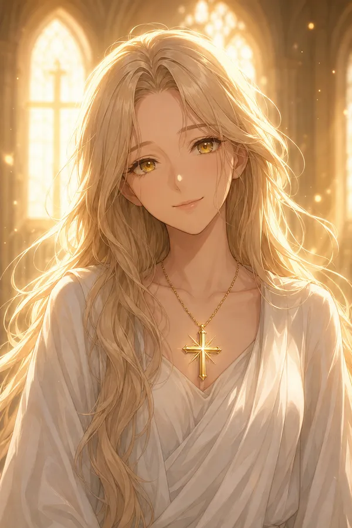

Seyrell

previous Chosen of Aria, a generation before Lucius and Aevos

</a>

<a href="organizations/churches/church-of-love">Church of Love</a>

<a class="char-card" href="characters/vera-justicar">

Vera Justicar

High Priestess

</a>
<a class="char-card" href="characters/vero-justicar">

Vero Justicar

son of Vera

</a>
<a class="char-card" href="characters/ludwig-st.-james">

Ludwig St. James

Chosen of Mara

</a>

<a href="organizations/churches/church-of-the-storm">Church of the Storm</a>

<a class="char-card" href="characters/backstory-npcs/torr-galefri">

Torr Galefri

current head of the church

</a>
<a class="char-card" href="player-characters/aella-galefri">

Aella Galefri

former member

</a>
<a class="char-card" href="characters/backstory-npcs/urami-galefri">

Urami Galefri

</a>
<a class="char-card" href="characters/backstory-npcs/arashi-galefri">

Arashi Galefri

</a>
<a class="char-card" href="characters/backstory-npcs/whiro-galefri">

Whiro Galefri

</a>

## Independent Factions

<a href="organizations/the-people's-liberation-front-of-brittania">The People's Liberation Front of Brittania</a>

<a class="char-card" href="characters/lanius">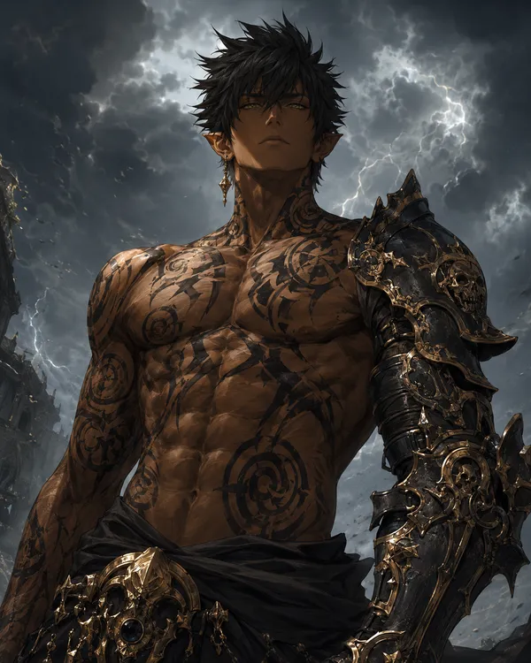

Lanius

head of the organization

</a>
<a class="char-card" href="characters/roland-royce">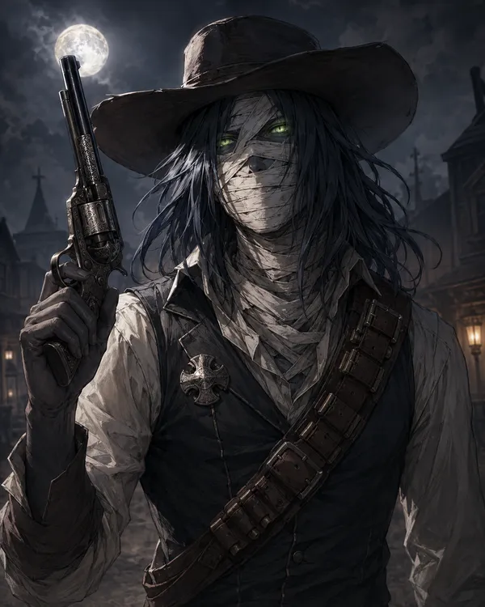

Roland Royce

acting chief

</a>
<a class="char-card" href="player-characters/callum">

Callum

collaborator

</a>

<a href="organizations/honest-hearts">Honest Hearts</a>

<a class="char-card" href="characters/ludwig-st.-james">

Ludwig St. James

founder and funder

</a>
<a class="char-card" href="player-characters/aella-galefri">

Aella Galefri

</a>
<a class="char-card" href="player-characters/cyris-voss">

Cyris Voss

</a>
<a class="char-card" href="player-characters/kip">

Kip

</a>
<a class="char-card" href="player-characters/kieran-arden">

Kieran Arden

</a>
<a class="char-card" href="player-characters/seros-ashwalker">

Seros Ashwalker

</a>
<a class="char-card" href="player-characters/solstice-shuriv">

Solstice Shuriv

</a>

## The Pantheon

<a href="organizations/pantheon-of-gods">Pantheon of Gods</a>

<a class="char-card" href="characters/gods/aria">

Aria

Goddess of Light, Truth, and Justice

</a>
<a class="char-card" href="characters/gods/dari">

Dari

Goddess of Luck, Good Fortune, and Miracles

</a>
<a class="char-card" href="characters/gods/dark-man">

Dark man

God of Darkness, Deceit, and Death

</a>
<a class="char-card" href="characters/gods/erebus">

Erebus

God of Pain, Agony, and Murder

</a>
<a class="char-card" href="characters/gods/helios">

Helios

God of the Sun

</a>
<a class="char-card" href="characters/gods/hermaus-mora">

Hermaus Mora

God of Knowledge, Secrets, and Wisdom

</a>
<a class="char-card" href="characters/gods/indra">

Indra

God of the Sky

</a>
<a class="char-card" href="characters/gods/judas">

Judas

God of Lies, Deceit, and Thievery

</a>
<a class="char-card" href="characters/gods/kharn">

Kharn

God of War, Victory, and Glory

</a>
<a class="char-card" href="characters/gods/luna">

Luna

Goddess of the Moon

</a>
<a class="char-card" href="characters/gods/mara">

Mara

Goddess of Love, Fertility, and Life

</a>
<a class="char-card" href="characters/gods/veyrana">

Veyrana

Goddess of Storms

</a>
<a class="char-card" href="characters/gods/wylder">

Wylder

God of Ascension

</a>

## Demons

<a href="organizations/the-twelve-demon-generals">Demons & Demon Generals</a>

<a class="char-card" href="characters/demons/luciferus">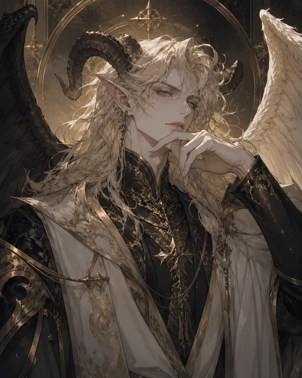

Luciferus

The Demon Prince

</a>
<a class="char-card" href="characters/null">

Null

</a>
<a class="char-card" href="characters/demons/x">

X

Demon General of Magic

</a>
<a class="char-card" href="characters/demons/kronos">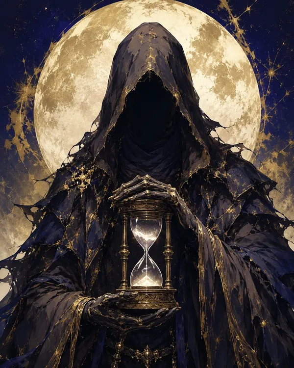

Kronos

Demon General of Time

</a>

## Unaffiliated & Others

<a class="char-card" href="characters/alira-lyuval">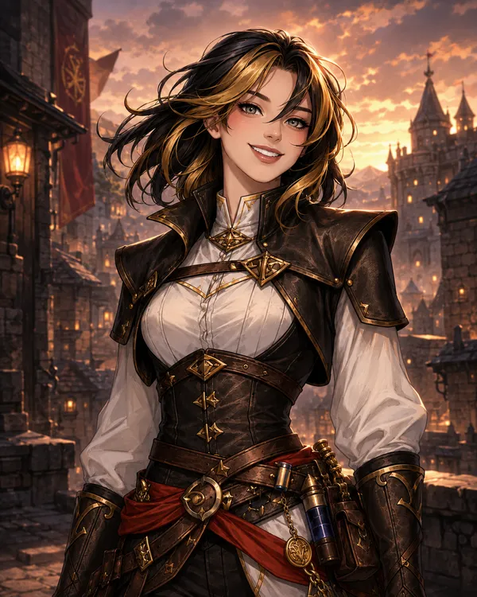

Alira Lyuval

</a>
<a class="char-card" href="characters/backstory-npcs/dorn-ashkel">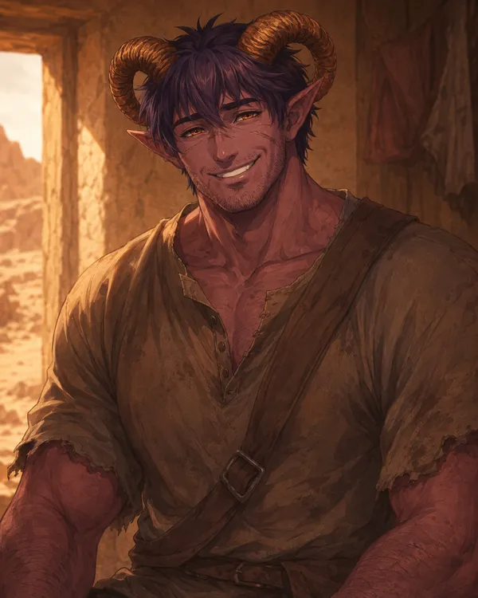

Dorn Ashkel

</a>
<a class="char-card" href="characters/hannibal">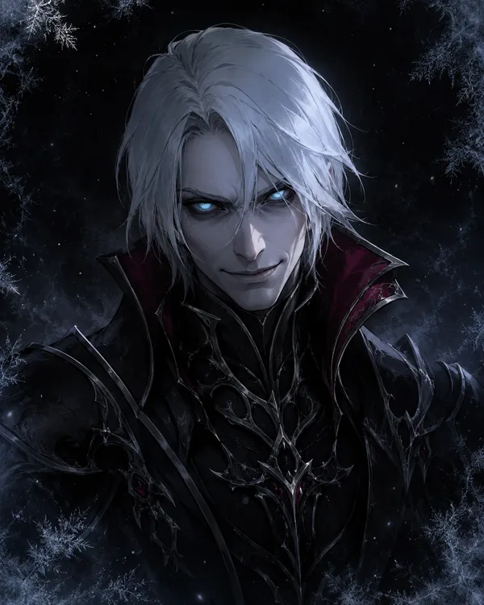

Hannibal

</a>
<a class="char-card" href="characters/hero-with-no-name">

Hero With No Name

</a>
<a class="char-card" href="characters/backstory-npcs/kane-orso">

Kane Orso

</a>
<a class="char-card" href="player-characters/leandros-thalassor">

Leandros Thalassor

</a>
<a class="char-card" href="characters/backstory-npcs/lord-hector-vance">

Lord Hector Vance

</a>
<a class="char-card" href="characters/melan-thalassa">

Melan Thalassa

</a>
<a class="char-card" href="characters/michael-the-evangelist">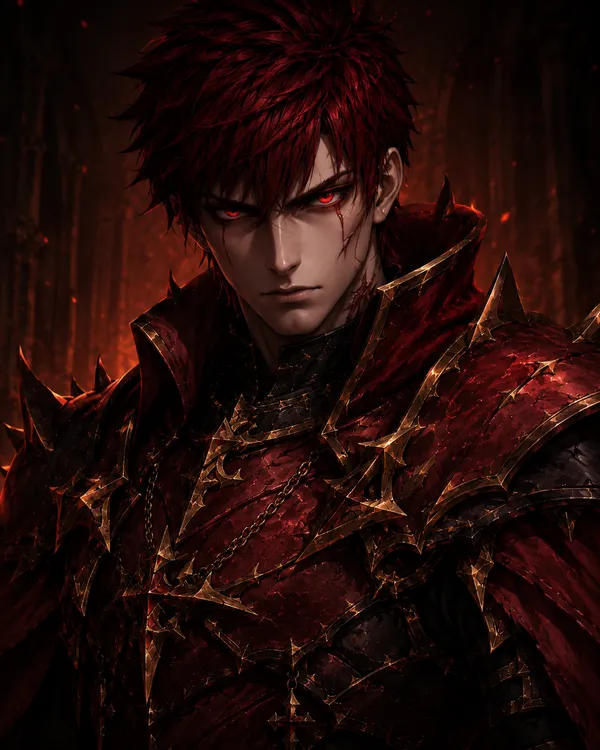

Michael the Evangelist

</a>
<a class="char-card" href="characters/backstory-npcs/mira">

Mira

</a>
<a class="char-card" href="characters/backstory-npcs/nixi">

Nixi

</a>
<a class="char-card" href="characters/razaar-blackwing">

Razaar Blackwing

</a>
<a class="char-card" href="characters/backstory-npcs/roland-voss">

Roland Voss

</a>
<a class="char-card" href="characters/saelen-brightfeather">

Saelen Brightfeather

</a>
<a class="char-card" href="characters/backstory-npcs/serapha-ashkel">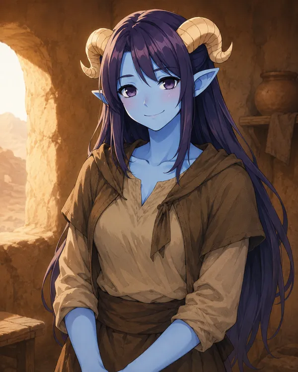

Serapha Ashkel

</a>
<a class="char-card" href="characters/the-lone-wanderer">

The Lone Wanderer

</a>
<a class="char-card" href="characters/the-warden">

The Warden

</a>
<a class="char-card" href="characters/veyr">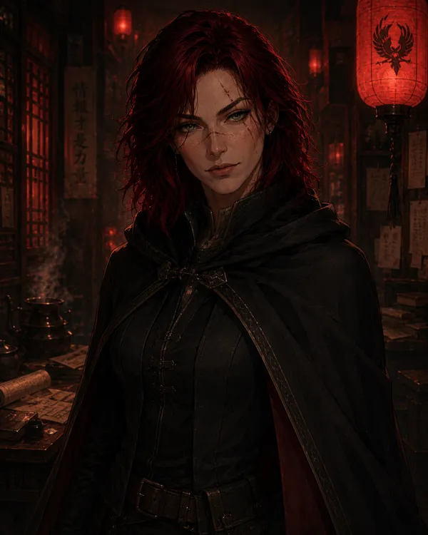

Veyr

</a>

