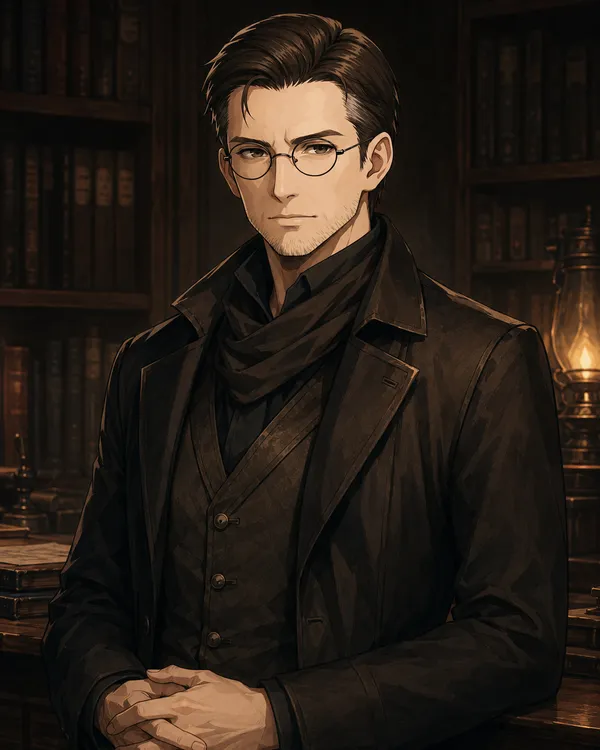

---
aliases:
  - "Roland"
type: "character"
campaign:
  - "1"
race: "Human"
age: "44"
height: "unknown"
affiliation:
  - "[[Brittania]]"
status: "alive"
title: "Roland Voss"
---

<aside class="infobox">

Roland Voss

<table><tr><th>Aliases</th><td>Roland</td></tr><tr><th>Race</th><td>Human</td></tr><tr><th>Age</th><td>44</td></tr><tr><th>Status</th><td>alive</td></tr><tr><th>Affiliation</th><td><a href="../../locations/countries/brittania">Brittania</a></td></tr><tr><th>Campaign</th><td>1</td></tr></table>
</aside>

![[Roland Voss (4x5 Portrait).webp|350]] ![[Roland Voss.webp|400]]

## Overview

Roland Voss is [[Cyris Voss]]'s adopted father — a merchant from a Brittanian family who was the third son and inherited little. He encountered Cyris at age 9 in [[The Badlands]], recognized his exceptional talent, and offered him passage to [[Brittania]], education, and stability in exchange for taking the Voss surname. He is not warm, but not unkind. He shaped Cyris as an investment, not a child.

## Appearance

- Human, 40s
- Never raises his voice — doesn't need to
- Stillness that unsettles more than anger in negotiations

## Personality

Efficient and controlled. Some call him cruel, others merely efficient — no one calls him careless. Provided everything Cyris needed; always with an unspoken understanding that nothing is free.

## History

Third son of a Brittanian merchant family — inherited little. Encountered young Cyris in [[The Badlands]] selling enchanted devices. Saw potential, not a child to save. Offered Cyris the Voss name, passage to Brittania, and education. Drilled him relentlessly toward [[Strixhaven]]. Cyris earned a scholarship and exceeded all expectations — though Roland's expectations were always about returns.

## Relationships

- [[Cyris Voss]] — his adopted son; Cyris took his surname; taught Cyris that names open doors and doors have prices
- [[Brittania]] — his homeland

## Story

*(Has not appeared in sessions yet — backstory character.)*
