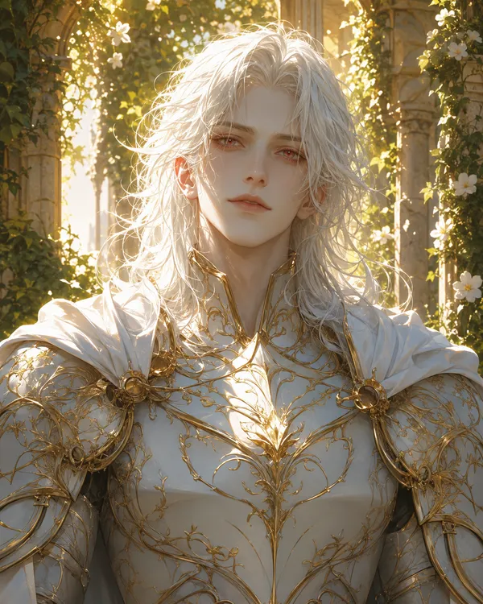

---
aliases:
  - "Raevyn"
  - "Raevyn the Redeemer"
  - "The Redeemer"
type: "character"
campaign:
  - "1"
  - "2"
race: "unknown"
age: "unknown"
height: "unknown"
affiliation:
  - "[[The Kingsguard]]"
  - "[[House Whitlocke]]"
status: "deceased"
title: "Raevyn Whitlocke"
---

<aside class="infobox">

Raevyn Whitlocke

<table><tr><th>Aliases</th><td>Raevyn, Raevyn the Redeemer, The Redeemer</td></tr><tr><th>Status</th><td>deceased</td></tr><tr><th>Affiliation</th><td><a href="../../organizations/the-kingsguard">The Kingsguard</a> <a href="../../organizations/noble-houses/house-whitlocke">House Whitlocke</a></td></tr><tr><th>Campaign</th><td>1, 2</td></tr></table>
</aside>

![[Raevyn Whitlocke (4x5 Portrait).webp|350]] ![[Raevyn Whitlocke (Reference).webp|350]]

## Overview

Raevyn the Redeemer was a legendary knight from ancient Brittanian history. In 150CC, he founded [[The Kingsguard]] — the elite royal guard that still serves the crown today. His direct descendants make up [[House Whitlocke]], which holds his legendary weapon, **Heaven's Hope**. His modern-day descendant is [[Raven Whitlock]].

## Appearance

- White hair, medium-to-long, loose and flowing
- Pale, almost ethereal skin — looks otherworldly, as though light clings to him
- White and gold ornate plate armor with flowing filigree and vine-like gold engravings across the chest, shoulders, gauntlets, and greaves
- White cape draped behind him
- Wields **Heaven's Hope** — an elegant golden-hilted greatsword
- Overall impression: holy, radiant, something more than human; the kind of figure who becomes a legend not because people exaggerate but because they can't describe what they actually saw

*(Character design inspired by Yoriichi Tsugikuni from Kimetsu no Yaiba — the same quiet, overwhelming strength and beauty.)*

## Personality

*(Unknown)*

## History

Founded [[The Kingsguard]] in 150CC. The details of his life and what earned him the title "The Redeemer" are lost to history.

## Relationships

- [[The Kingsguard]] — he founded it in 150CC
- [[House Whitlocke]] — founded by him; his direct descendants carry his legacy
- [[Raven Whitlock]] — modern-day descendant
