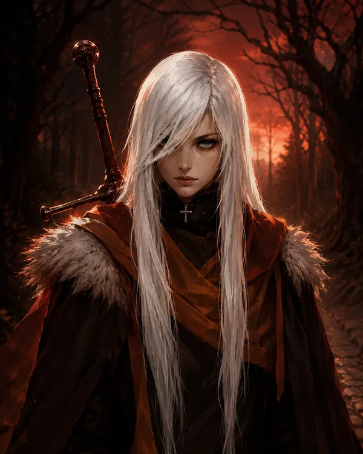

---
aliases:
  - "Raven"
type: "character"
campaign:
  - "1"
  - "2"
race: "unknown"
age: "unknown"
height: "unknown"
affiliation:
  - "[[House Whitlocke]]"
status: "alive"
title: "Raven Whitlock"
---

<aside class="infobox">

Raven Whitlock

<table><tr><th>Aliases</th><td>Raven</td></tr><tr><th>Status</th><td>alive</td></tr><tr><th>Affiliation</th><td><a href="../organizations/noble-houses/house-whitlocke">House Whitlocke</a></td></tr><tr><th>Campaign</th><td>1, 2</td></tr></table>
</aside>

![[Raven Whitlock (4x5 Portrait).webp|350]] ![[Raven Whitlock (Reference).webp|350]]

## Overview

Raven Whitlock is the current and "final" heir to [[House Whitlocke]], the modern-day descendant of [[Raevyn Whitlocke]], the legendary founder of The Kingsguard.

## Appearance

- Long, straight white hair falling well past her waist
- Sharp, intense eyes with a guarded, untrusting expression
- Black choker with a small cross pendant at her throat
- Fur-trimmed burnt orange and brown layered clothing — a heavy dark cloak over warmer-toned inner layers
- Carries a sword on her back — hilt visible over her right shoulder
- Overall impression: someone raised in legacy but living rough; more wanderer than noblewoman

## Relationships

- [[Raevyn Whitlocke]] — her ancestor; founder of The Kingsguard
- [[House Whitlocke]] — her house
