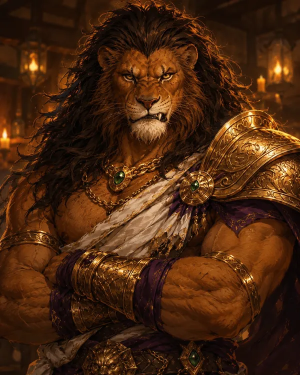

---
aliases:
  - "Samson"
  - "Samson Lionheart"
type: "character"
campaign:
  - "2"
race: "leonin"
age: "unknown"
height: "7'0"
affiliation:
  - "[[The People's Liberation Front of Brittania]]"
status: "alive"
title: "Samson Bloodmane"
---

<aside class="infobox">

Samson Bloodmane

<table><tr><th>Aliases</th><td>Samson, Samson Lionheart</td></tr><tr><th>Race</th><td>leonin</td></tr><tr><th>Height</th><td>7'0</td></tr><tr><th>Status</th><td>alive</td></tr><tr><th>Affiliation</th><td><a href="../organizations/the-people's-liberation-front-of-brittania">The People's Liberation Front of Brittania</a></td></tr><tr><th>Campaign</th><td>2</td></tr></table>
</aside>

![[Samson Bloodmane (4x5 Portrait).webp|350]] ![[Samson Bloodmane (Full Body).webp|350]]

## Overview

Samson Bloodmane is a leonin barbarian and member of [[The People's Liberation Front of Brittania]], recruited by [[Lanius]] for his raw strength. Standing 7 feet tall, he is loud, aggressive, and constantly looking for a fight. He comes from a noble line of leonin in [[Elsweyr]] — a nomadic pride where combat was a way of life.

## Appearance

- 7 feet tall, massive muscular build
- Leonin (lion-like humanoid) with tawny golden fur
- Full dark lion's mane — long, wild, flowing past the shoulders
- Exposed muscular torso
- Purple and white cloth wraps — deep purple waist sash and loincloth with white sashes draped over shoulders
- Gold ornamental armor: bangles and arm guards on both forearms, ornate belt with green gemstones, gold shoulder pauldrons
- Carries a large curved golden blade — a scimitar or falchion
- Imposing and bestial — radiates physical dominance

## Personality

Loud, aggressive, and always looking for a fight. Draws attention to himself constantly. Dismissive of weaker opponents — "those small fries are nothing." Respects strength above all else. Nostalgic for his homeland where fights were never in short supply. Despite his brashness, follows orders and stays loyal to the Front's cause.

## History

From a noble line of leonin in [[Elsweyr]]. His people are fairly nomadic, and he grew up in a pride where fighting was constant. Was sought out and recruited by [[Lanius]] specifically for his strength. Has fought [[Damian Grimm]] at some point and considers him a worthy opponent.

## Relationships

- [[The People's Liberation Front of Brittania]] — member
- [[Lanius]] — recruited him for his strength; Samson respects him
- [[Roland Royce]] — works alongside him in the Front
- [[Vernan Hawkes]] — fellow Front member; initially skeptical of Vernan's skill
- [[Callum]] — Front-adjacent operative; Samson was antsy during Callum's briefing
- [[Damian Grimm]] — fought him at some point; considers him a good fight ("the blood boy from the Kingsguard")

## Story

**Session 1 (Campaign 2):** Present at a bar meeting alongside [[Roland Royce]] and [[Vernan Hawkes]]. Was dismissive of the bar patrons and initially questioned Vernan's skill before Roland vouched for him. Mentioned that [[Damian Grimm]] was a good fight — Roland scowled at the memory. During [[Callum]]'s separate briefing, Samson was visibly antsy and ready to leave. After Callum departed, started a fight in the bar. Reminisced about [[Elsweyr]] — "never a shortage of fights back in my pride."
