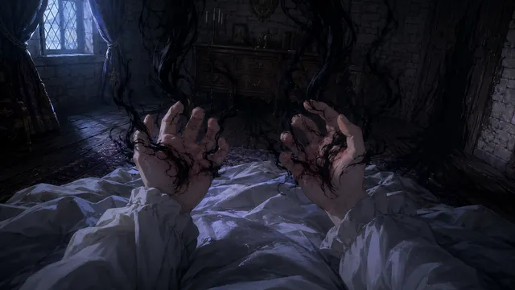
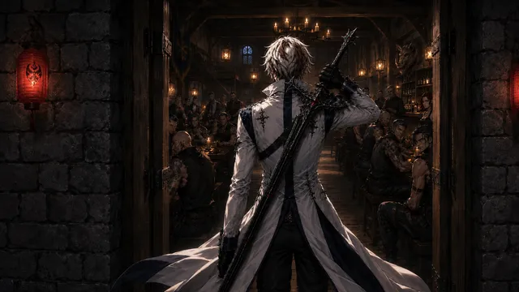
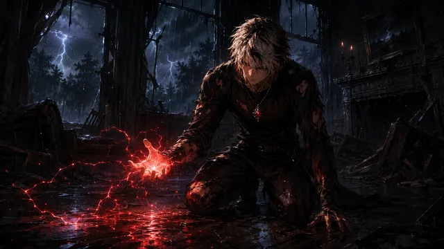
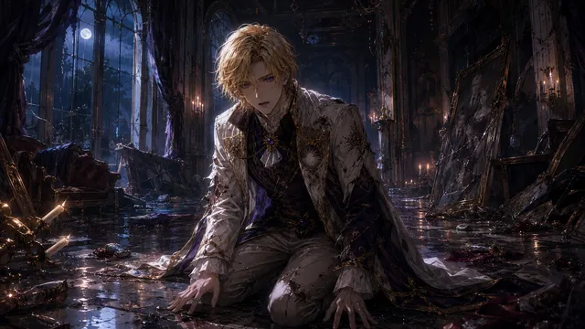
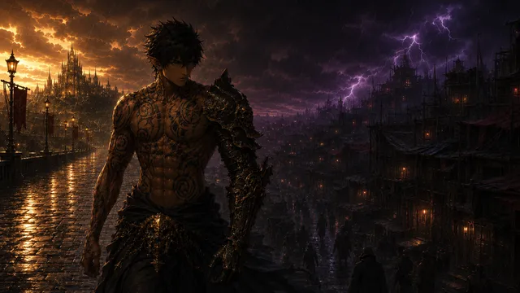

⸻ Campaign 1 — Session Chronicles ⸻

<a class="shelf-card" href="story/sessions/campaign-1/campaign-1---session-09-(07-27)">Session 907-27The opening scene is the slums of Caer Brittanis — Lowtown.</a>
<a class="shelf-card" href="story/sessions/campaign-1/campaign-1---session-08-(07-13)">Session 807-13Manuel kills the Warden. Damian is found barely breathing in a crater. Kieran is confirmed dead. Solstice…</a>
<a class="shelf-card" href="story/sessions/campaign-1/campaign-1---session-07-(05-31)">Session 705-31The royal parade is attacked. Hannibal reveals himself. Kieran is nearly killed. Kylo drops the biggest lore…</a>
<a class="shelf-card" href="story/sessions/campaign-1/campaign-1---session-06-(05-19)">Session 605-19Parade briefing, training with Lucerin, Aella spars Jean, and Lanius is revealed.</a>
<a class="shelf-card" href="story/sessions/campaign-1/campaign-1---session-05">Session 5The assassin is interrogated by Damian.</a>
<a class="shelf-card" href="story/sessions/campaign-1/campaign-1---session-04">Session 4The party shops for equipment, learns more about Ludwig and Damian, and encounters assassins on the rooftop.</a>
<a class="shelf-card" href="story/sessions/campaign-1/campaign-1---session-03">Session 3The party arrives at the guild hall and meets Seros.</a>
<a class="shelf-card" href="story/sessions/campaign-1/campaign-1---session-02">Session 2Present timeline. The party meets for the first time in prison, then is brought before King Lucerin.</a>
<a class="shelf-card" href="story/sessions/campaign-1/campaign-1---session-01-(doomed-future-prologue)">Session 1doomed future prologueThis session takes place in The Doomed Timeline — a destroyed future approximately 20 years ahead of the…</a>

⸻ Side Stories ⸻

<a class="tale-card has-thumb" href="story/side-stories/tirian---the-awakening">Tirian — The Awakeningby Trace</a>
<a class="tale-card has-thumb" href="story/side-stories/tirian---first-light">Tirian — First Lightby Trace</a>
<a class="tale-card has-thumb" href="story/side-stories/callum---sword-of-roland">Callum — Sword of Rolandby Bonner</a>
<a class="tale-card has-thumb" href="story/side-stories/kaisel---the-crooked-boar">Kaisel — The Crooked Boarby Tre</a>
<a class="tale-card has-thumb" href="story/side-stories/kaisel---too-clean">Kaisel — Too Cleanby Tre</a>
<a class="tale-card has-thumb" href="story/side-stories/kaisel---what-was-left">Kaisel — What Was Leftby Tre</a>
<a class="tale-card has-thumb" href="story/side-stories/tirian---one-night">Tirian — One Nightby Trace</a>
<a class="tale-card has-thumb" href="story/side-stories/lanius---the-duty-of-the-strong">Lanius — The Duty of the Strongby Migs (DM)</a>
<a class="tale-card has-thumb" href="story/side-stories/garrick---the-boy-who-chased-the-unknown">Garrick — The Boy Who Chased the Unknownby Gio</a>
<a class="tale-card has-thumb" href="story/side-stories/callum---out-of-the-crystal">Callum — Out of the Crystalby Bonner</a>
<a class="tale-card has-thumb" href="story/side-stories/tirian---what-she-inherited">Tirian — What She Inheritedby Trace</a>

⸻ Timeline of Events ⸻

approximately 100 years before Campaign 1

<a href="story/events/the-great-decimation">The Great Decimation</a>The decimation of The Badlands that happened roughly 100 years ago.

approximately 3 years before Campaign 2

<a href="story/events/the-dawnmere-slaughter">The Dawnmere Slaughter</a>Three years before Campaign 2, House Dawnmere was massacred.

approximately 1 month before Campaign 1 begins

<a href="story/events/assassination-of-the-royal-family">Assassination of the Royal Family</a>Approximately one month before Campaign 1 begins, the entire Brittanian royal family was murdered…

unknown (far future, ~20 years from campaign present)

<a href="story/events/the-doomed-timeline">The Doomed Timeline</a>The Doomed Timeline is the destroyed future that serves as the prologue to Campaign 1 (Session 1).

…more events of Eldoria's history are yet to be chronicled.

⸙ ❦ ⸙

