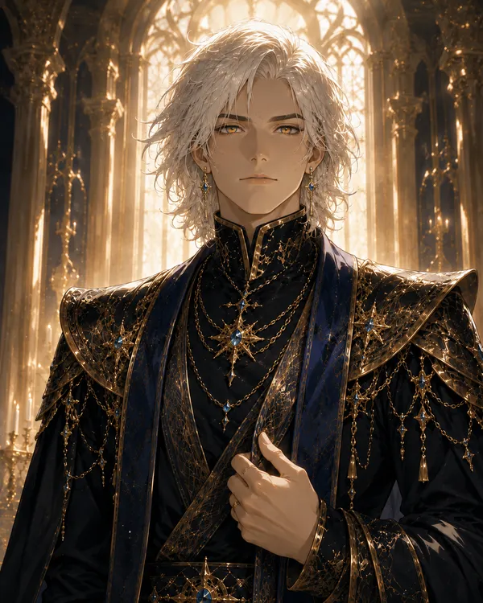

❦

<h1>The Eldoria Expanse</h1>

A chronicle of two campaigns across the realm of Eldoria — its heroes, gods, kingdoms, and the storms gathering over Brittania.

<a class="nav-card" href="./all-characters"><svg viewBox="0 0 24 24" fill="none" stroke="currentColor" stroke-width="1.4" stroke-linecap="round"><path d="M4 4 L15 15 M15 15 l3 3 M13.5 16.5 L16.5 13.5 M18 18 l2 2"/><path d="M20 4 L9 15 M9 15 l-3 3 M10.5 16.5 L7.5 13.5 M6 18 l-2 2"/></svg>CharactersHeroes, nobles, gods, and demons</a>
<a class="nav-card" href="./chronicles"><svg viewBox="0 0 24 24" fill="none" stroke="currentColor" stroke-width="1.4" stroke-linecap="round"><path d="M3 5.5 C7 3.5 10.5 4.5 12 6.5 C13.5 4.5 17 3.5 21 5.5 V18 C17 16.5 13.5 17 12 19 C10.5 17 7 16.5 3 18 Z"/><path d="M12 6.5 V19"/></svg>StorySessions, side stories, and events</a>
<a class="nav-card" href="./atlas"><svg viewBox="0 0 24 24" fill="none" stroke="currentColor" stroke-width="1.4" stroke-linecap="round"><path d="M7 21 V8 M17 21 V8 M5 8 H19 M6 8 V5 H9 V7 H11 V5 H13 V7 H15 V5 H18 V8 M5 21 H19 M10 21 V15 H14 V21"/></svg>LocationsThe realms and cities of Eldoria</a>
<a class="nav-card" href="./heraldry"><svg viewBox="0 0 24 24" fill="none" stroke="currentColor" stroke-width="1.4" stroke-linecap="round"><path d="M12 3 L19 5.5 V11 C19 16 16.2 19.3 12 21 C7.8 19.3 5 16 5 11 V5.5 Z"/><path d="M12 7 V17 M8.5 10 H15.5"/></svg>OrganizationsHouses, churches, and orders</a>
<a class="nav-card" href="./grimoire"><svg viewBox="0 0 24 24" fill="none" stroke="currentColor" stroke-width="1.4" stroke-linecap="round"><path d="M12 3 L14.2 9.8 L21 12 L14.2 14.2 L12 21 L9.8 14.2 L3 12 L9.8 9.8 Z"/><circle cx="12" cy="12" r="2.2"/></svg>PowersMagic, gifts, and forbidden arts</a>
<a class="nav-card" href="./appendices"><svg viewBox="0 0 24 24" fill="none" stroke="currentColor" stroke-width="1.4" stroke-linecap="round"><path d="M6 4 H19 C20.1 4 21 4.9 21 6 C21 7.1 20.1 8 19 8 H8 M6 4 C4.9 4 4 4.9 4 6 V18 C4 19.1 4.9 20 6 20 H17 C18.1 20 19 19.1 19 18 V8"/><path d="M8 11 H15 M8 14 H15 M8 17 H12"/></svg>AppendicesCosmology, rosters, and records</a>

⸻ The Current Party ⸻

Campaign 2

<a class="party-card" href="player-characters/aevos">Aevos</a>
<a class="party-card" href="player-characters/callum">Callum</a>
<a class="party-card" href="player-characters/garrick">Garrick</a>
<a class="party-card" href="player-characters/kaisel-irvenest">Kaisel</a>
<a class="party-card" href="player-characters/tirian-dawnmere">Tirian</a>

⸻ Latest Chronicles ⸻

<a class="chron-row" href="story/sessions/campaign-1/campaign-1---session-09-(07-27)">Campaign 1Campaign 1 - Session 09 (07-27)</a>
<a class="chron-row" href="story/side-stories/tirian---first-light">Side StoryTirian - First Light</a>
<a class="chron-row" href="story/side-stories/callum---sword-of-roland">Side StoryCallum - Sword of Roland</a>
<a class="chron-row" href="story/side-stories/kaisel---the-crooked-boar">Side StoryKaisel - The Crooked Boar</a>

⸙ ❦ ⸙

